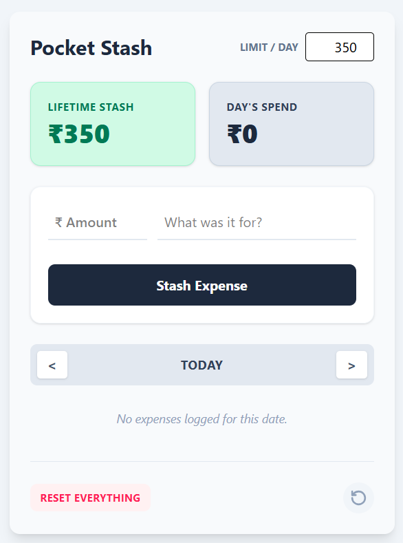

# 💰 Pocket Stash

Pocket Stash is a lightweight, gamified personal finance web app designed for single-player use. Instead of tracking complex monthly budgets, it focuses on a **"rollover" daily allowance**—rewarding you for staying under your daily spending limit by visualizing your accumulated savings (your "Stash") over time.



## 🧠 The Core Concept & Math
The app abandons traditional budgeting in favor of a daily micro-budget. 

1. You set a **Maximum Daily Limit** (e.g., ₹500).
2. The app calculates the total allowance you *should* have had since the day you started using the app.
3. It subtracts every logged expense to generate your **Accumulated Stash**.

**The Formula:**
> `(Days Elapsed × Daily Limit) - Total Lifetime Spend = Accumulated Stash`

If you spend less than your limit today, the leftover automatically rolls over, making your Stash grow. If you overspend, it eats into your Stash.

## ✨ Key Features
- **Dynamic Dashboard:** Instantly view your active Daily Limit, Today's Spend, and your lifetime Accumulated Stash.
- **Frictionless Logging:** A simple, two-input form to instantly stash an expense without navigating menus.
- **Time-Travel Ledger:** View and manage expenses for any specific day using a hidden, native date picker.
- **Full CRUD:** Edit or delete past transactions easily.
- **Safety Nets:** "Reset Everything" capability with an instant "Undo" backup feature.

## 🛠️ Technical Stack
- **Frontend:** React + Vite
- **Styling:** Tailwind CSS v4 (Mobile-first, responsive design)
- **Database:** Supabase (PostgreSQL)
- **Architecture:** Zero-Backend / Serverless. The React client communicates directly with Supabase using Row Level Security (RLS) for access control.

## 🚀 Quick Start (Local Setup)

Because Pocket Stash is a "zero-backend" app, setup is incredibly fast.

### 1. Clone & Install
```bash
git clone https://github.com/yourusername/pocket-stash.git
cd pocket-stash
npm install
```

### 2. Supabase Setup
1. Create a new project on [Supabase](https://supabase.com/).
2. Go to the **SQL Editor** and run the following schema to create the tables and enable Row Level Security (RLS) for anonymous access:

<details>
<summary>Click to view SQL Schema</summary>

```sql
-- Create settings table
CREATE TABLE budget_settings (
  id integer PRIMARY KEY DEFAULT 1,
  daily_limit numeric NOT NULL DEFAULT 500,
  start_date date NOT NULL DEFAULT CURRENT_DATE
);

-- Insert default configuration
INSERT INTO budget_settings (id, daily_limit, start_date)
VALUES (1, 500, CURRENT_DATE)
ON CONFLICT (id) DO NOTHING;

-- Create transactions table
CREATE TABLE budget_transactions (
  id uuid PRIMARY KEY DEFAULT gen_random_uuid(),
  amount numeric NOT NULL,
  description text,
  txn_date date NOT NULL,
  created_at timestamp with time zone DEFAULT timezone('utc'::text, now()) NOT NULL
);

-- Enable RLS
ALTER TABLE budget_settings ENABLE ROW LEVEL SECURITY;
ALTER TABLE budget_transactions ENABLE ROW LEVEL SECURITY;

-- Allow anonymous CRUD (Single-player mode)
CREATE POLICY "Enable full access for anon on settings" ON budget_settings FOR ALL TO anon USING (true) WITH CHECK (true);
CREATE POLICY "Enable full access for anon on transactions" ON budget_transactions FOR ALL TO anon USING (true) WITH CHECK (true);
```
</details>

### 3. Environment Variables
Create a `.env.local` file in the root directory and add your Supabase URL and Anon Key:
```env
VITE_SUPABASE_URL=your_supabase_project_url
VITE_SUPABASE_ANON_KEY=your_supabase_anon_key
```

### 4. Run the App
```bash
npm run dev
```
Navigate to `http://localhost:5173` in your browser.

## 🔒 Security Note
This app is designed as a **single-player personal tool**. It bypasses traditional user authentication by using Supabase RLS policies configured to allow full access to the `anon` role. Anyone with your environment variables can view or edit the database. Do not use this configuration for a multi-user production app.

---
*Built with ❤️ to make saving money feel like a game.*
